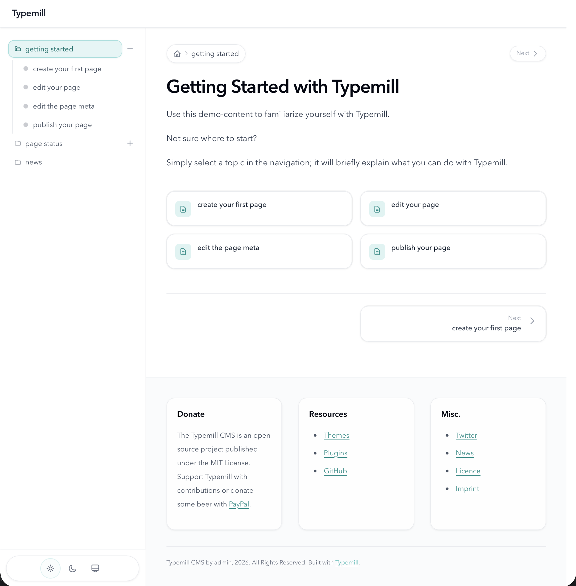

# Rückenwind

A clean [Typemill](https://typemill.net) theme built on Tailwind CSS 4.2. Inspired by the Typhoon Grav theme and the
Cyanine Typemill theme.



## Features

- Sidebar navigation with collapsible folders
- Automatic dark mode following system preference, with a manual icon-based Light / Dark / System toggle
- Optional homepage hero (title, tagline, call-to-action button)
- Blog mode: use the homepage as a post listing
- Per-page author, date, edit link, and print button
- Up to three Markdown footer columns
- Customizable accent color and custom CSS

## Installation

See [Installation in the project README](../../README.md#installation).

## Development

The compiled stylesheet is included in this repo at `css/theme.css`, so normal theme users do not need Node.js.

If you change the theme templates or source styles while developing the theme itself:

```bash
cd /path/to/typemill-html-developer-mode
npm install
npm run build:rueckenwind
```

Use `npm run watch:rueckenwind` for continuous rebuilds while iterating locally.

## Configuration

All settings are in the Typemill admin under **Theme Settings → Rückenwind**. Everything is self-explanatory in the UI —
hero content, blog mode, navigation labels, footer columns, colors, and a custom CSS field for any overrides.
